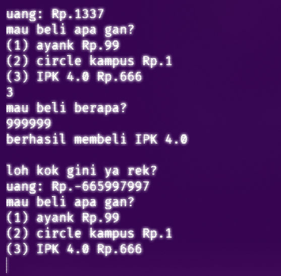
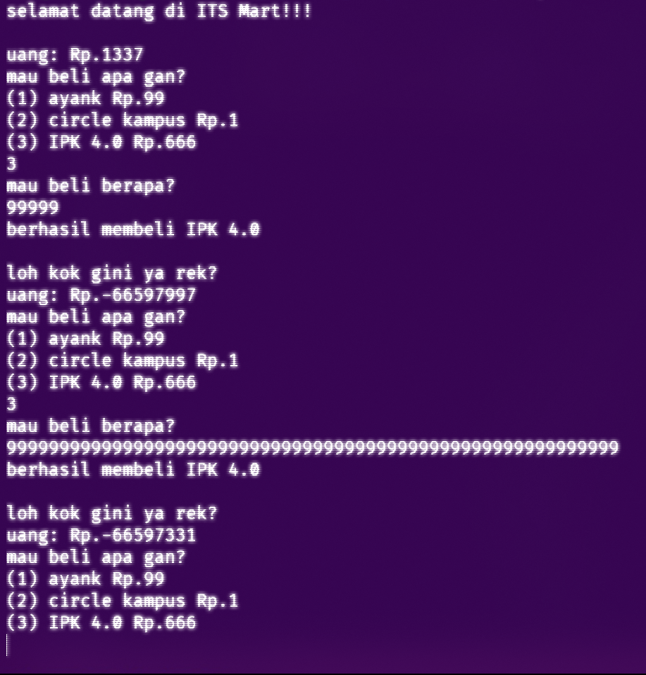
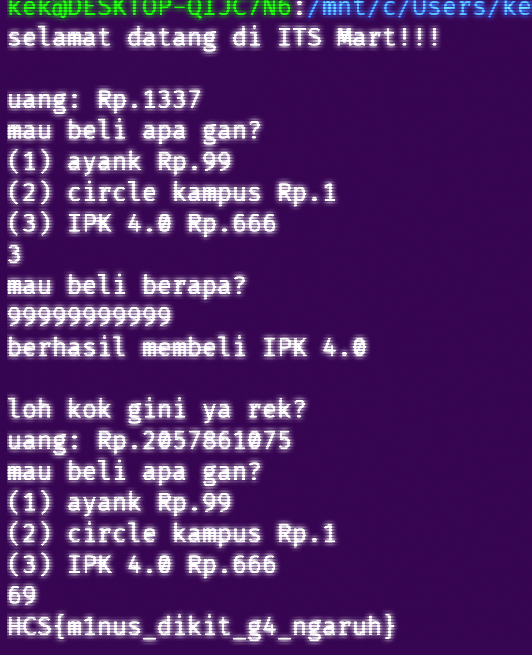

# **ITSMart**

**Difficulty:**

- Easy. (provided rating)
- A bit out-of-the-box (personal rating)

**Flag:** `HCS{m1nus_dikit_g4_ngaruh}`

---

## **EN**

For this challenge, we're provided with a TUI interface, and its [source code](./itsmart.c), to a hypothetical store:  

Interacting with it, the TUI is an item selection + item quantity input to buy from and a currency mechanism that decreases on purchase.

Inspecting the source code, we see that the money variable is set to an `int` type,

```c
int uang = 1337;
```

and each time a purchase occurs it gets subtracted by quantity multiplied by price.

```c
    // This is for the first item
    case 1:
        puts("mau beli berapa?");
        scanf("%d", &n);
        uang -= n * 99;
        puts("berhasil membeli ayank <3\n");
        break;
```

To get the flag, you need the money variable be > 999999999.

```c
        if(uang <= 999999999){
          puts("mau flag? harus kaya dlu broh\n");
        }
```

What's neat is, I see this bit right here:

```c
uang -= n * 99;
```

There's no `if` statement to check for the valuation after subtraction. This means that it is probably vulnerable to an **integer underflow** attack.

To confirm this, we can try purchasing the most expensive item and just, spam it.  
  
What's interesting is that, as seen above, you cannot spam it too much, otherwise it'll just, loop back.  


Anyway, so the solution's pretty clear now, it's just finding the right quantity to underflow to the maximum `int` value. 🎉


---

## **ID**

Untuk challenge ini, kita diberi intermuka TUI, dan [_source code_](./itsmart.c)nya, untuk sebuah toko:  

Cara kerjanya, intermukanya ada mekanisme seleksi item dan input kuantitas, kemudian ada mekanisme uang yang berkurang ketika pembelian.

Kalau kita liat di _source code_, uang di assign ke tipe `int`,

```c
int uang = 1337;
```

dan tiap kali ada pembelian dia dikurangi kuantitas dikali harga.

```c
    // Untuk item yg pertama
    case 1:
        puts("mau beli berapa?");
        scanf("%d", &n);
        uang -= n * 99;
        puts("berhasil membeli ayank <3\n");
        break;
```

Untuk dapetin _flag_, kita perlu uang > 999999999.

```c
        if(uang <= 999999999){
          puts("mau flag? harus kaya dlu broh\n");
        }
```

Nah, yang menarik itu ini:

```c
uang -= n * 99;
```

Ga ada `if` untuk ngecek _value_ uang setelah pengurangan. Ini berarti kemungkinan dia bisa kena **_integer underflow_**.

Kita bisa mastiin dengan kita spam aja yang paling mahal.  
  
Ini yang menariknya adalah, seperti kita lihat di atas, nggak bisa kita asal spam aja, karena bisa nge-_loop_ balik gitu.  


Nah, udah deh, tinggal nyari kuantitas yang pas biar dia _underflow_ ke bawahnya _value_ minimum `int`. 🎉

