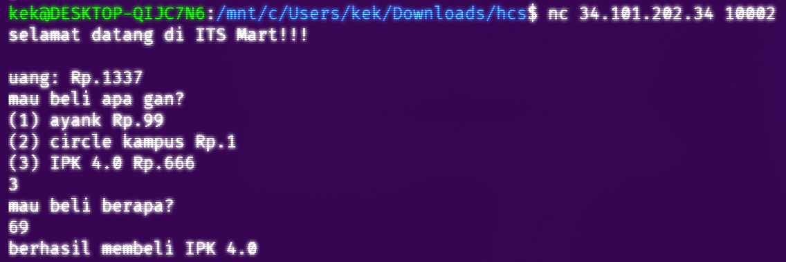

# **ITSMart**

**Difficulty:**

- Easy. (provided rating)
- A bit out-of-the-box (personal rating)

**Flag:** HCS{m1nus_dikit_g4_ngaruh}

---

## **EN**

For this challenge, we're provided with a TUI interface to a hypothetical store:  

Interacting with it, the TUI is an item selection + item quantity input to buy from and a currency mechanism that decreases on purchase.

Judging from what we've got so far, this seems to really be something relating to the I/O interface provided. Now, I'm no gamedev, so analysis of buffers isn't really my thing. But inspecting the source code of the program, this seemed to **_really_** pop out to me:
