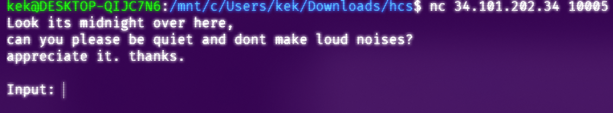
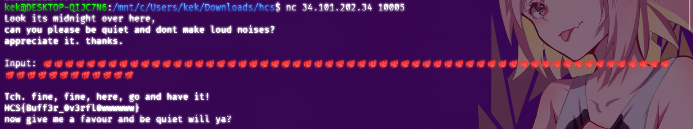

# **scream**

**Difficulty:** Beginner  
**Flag:** `HCS{Buff3r_0v3rfl0wwwwww}`

---

## **EN**

This one was a relatively easy one. Initially we're provided with a TUI interface and its [source code](./scream.c).


The interface is a simple one, just an ascii (UTF-8 (?), I wasn't really sure tbh, emotes worked, so probably 🤷) input to work with.

Inspecting the source code, the `give_flag` function is called by a segmentation fault handler.

```c
void sigsegv_handler(int sig){
  give_flag();
}

void setup(){
  signal(SIGSEGV, sigsegv_handler); // Set up signal handler
}
```

This tells me that this has got to do something with faulty memory access, and looking at the code further down confirms this.

```c
void vuln(){
  char buffer[0x100];
  gets(buffer);
}
```

A string buffer is allocated for `0x100`, so 256 bytes.

Now, all we have to do is spam it to overflow the buffer and cause a segfault. 👏


---

## **ID**

Yang ini lumayan gampang sih. Jadi awalnya kita dikasih antarmuka TUI dan [_source code_](./scream.c)nya.


Antarmukanya simpel, cumman input ascii (UTF-8 (?), ga yakin sih, emoji bisa, jadi mungkin 🤷).

Ngelihat di *source code*nya, function `give_flag` dijalankan oleh _handler segmentation fault_.

```c
void sigsegv_handler(int sig){
  give_flag();
}

void setup(){
  signal(SIGSEGV, sigsegv_handler); // Set up signal handler
}
```

Disini aku menyimpulkan bahwa ini pasti berhubungan dengan memori, dan ngelihat kebawah lagi membenarkan ini.

```c
void vuln(){
  char buffer[0x100];
  gets(buffer);
}
```

Buffer string dialokasikan hingga `0x100`, so 256 bytes.

Nah, kita tinggal spam aja deh sampe segfault. 👏

