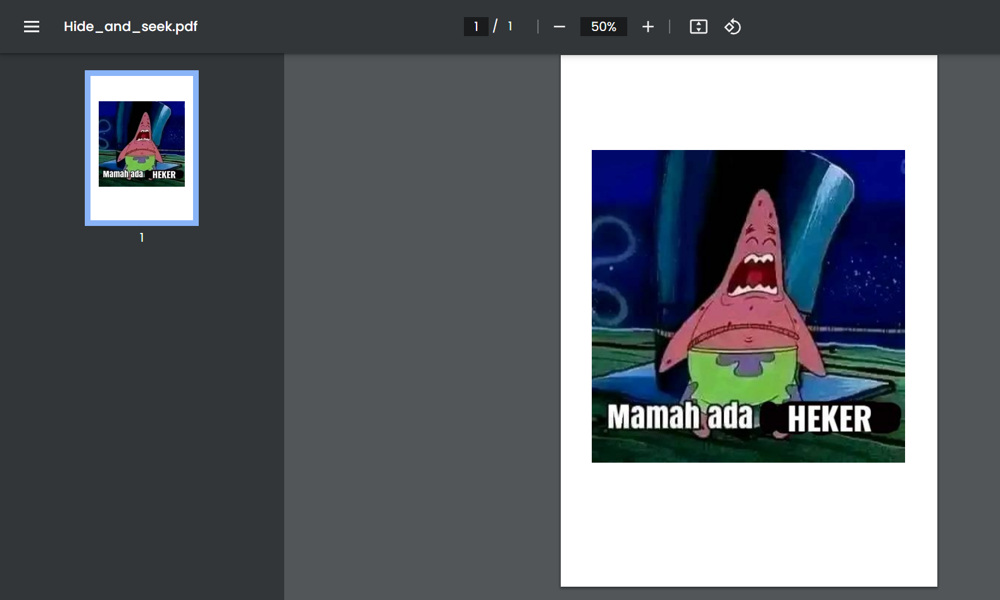

# **PDF Hide and Seek**

**Difficulty:** Easy (Personal Rating, not provided)  
**Flag:** `HCS{G00d_St4rt_W1th_PDF_0x13458}`

---

## **EN**

At first I thought that this one was going to be hard, judging from the fact that we're working with a PDF document, and [Adobe isn't exactly the company to be expecting a good file format standard from](https://github.com/gco/xee/blob/4fa3a6d609dd72b8493e52a68f316f7a02903276/XeePhotoshopLoader.m#L108), so I skipped it.

**But,** someone then started mentioning it, so I thought that this might have some value to it after all. SO I went back to it, and just, tried loading it up in Chrome.

Loaded up, it looked like this: 

Afterwards, the steps I took to get to the solution was:

1. I clicked around and got this:  
   

2. I realized it was text, and just `ctrl+a` it.

3. Pasted, I got this:

```
Hide and seek's origins trace back to ancient times, as people mimicked hunting in play. Medieval Europe saw early
versions. Indigenous cultures and Native American tribes embraced similar activities. By the 16th-18th centuries, regional
variations thrived. Modernization led to standardized rules and its English name. The 19th-20th centuries brought
widespread popularity as a childhood game, inspiring adaptations like "sardines" and "kick the can." Hide and seek's cultural
influence extended to literature and media. Despite technological advances, it remains relevant, nurturing social skills and
creativity. This enduring, universal game continues to connect generations through the joy of pursuit and discovery, but the
flag is HCS{G00d_St4rt_W1th_PDF_0x13458}
```

---

## **ID**

Awalnya kukira sulit, jadi diskip, terutama karena [Adobe itu terkenal nggak terkenal enak spec file formatnya](https://github.com/gco/xee/blob/4fa3a6d609dd72b8493e52a68f316f7a02903276/XeePhotoshopLoader.m#L108).

**Tapi,** pada mulai ngomongin tentang yang ini, jadi aku buka lagi, dan aku load aja PDFnya ke Chrome.

Ketika diload, seperti ini: 

Kemudian, langkah yang aku lakukan untuk mendapatkan solusi adalah:

1. Aku ngeklik-klik sampai begini:  
   

2. Aku sadar kalau itu teks, jadi aku coba `ctrl+a`.

3. Waktu di-paste, keluarlah outputnya:

```
Hide and seek's origins trace back to ancient times, as people mimicked hunting in play. Medieval Europe saw early
versions. Indigenous cultures and Native American tribes embraced similar activities. By the 16th-18th centuries, regional
variations thrived. Modernization led to standardized rules and its English name. The 19th-20th centuries brought
widespread popularity as a childhood game, inspiring adaptations like "sardines" and "kick the can." Hide and seek's cultural
influence extended to literature and media. Despite technological advances, it remains relevant, nurturing social skills and
creativity. This enduring, universal game continues to connect generations through the joy of pursuit and discovery, but the
flag is HCS{G00d_St4rt_W1th_PDF_0x13458}
```
