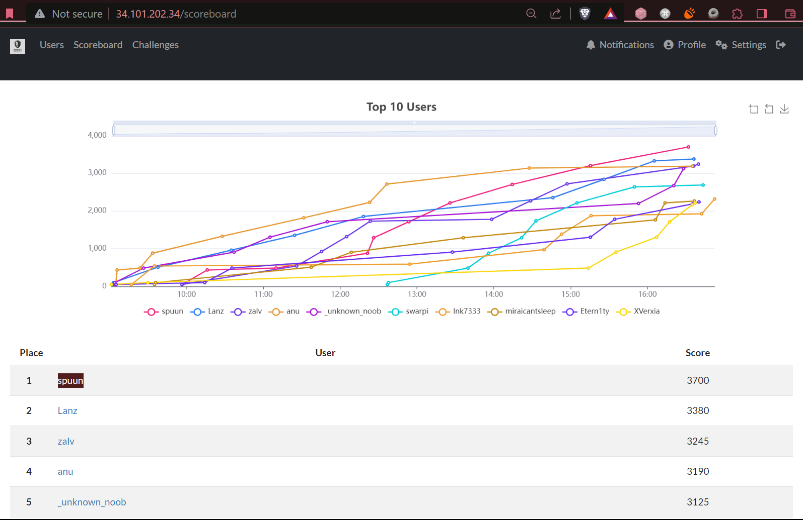

# **hcs-2023-writeup**

HCS CTF 2023 Writeup. Solved 8 out of a lot. All writeups were written bilingually.

First place,

List of contents:

1. Web Exploitation:
   - [ErCeE](./WebEx/ErCeE/)
   - [Requests](./WebEx/Requests/)
   - [Flasksibel](./WebEx/Flasksibel/)
2. Reverse Engineering:
   - [snake](./RevEng/snake/)
3. Binary Exploitation:
   - [ITSMart](./BinEx/ITSMart/)
   - [scream](./BinEx/scream/)
4. Forensics:
   - [Analyze the Bad Hacker!](./Forensic/Analyze%20the%20Bad%20Hacker!/)
   - [PDeF Hide and Seek](./Forensic/PDeF-HnS/)

> NOTE: All writeups in here were written in a somewhat nonformal register, as a stylistic choice. Expect verbose and conversational tone in explainers.
