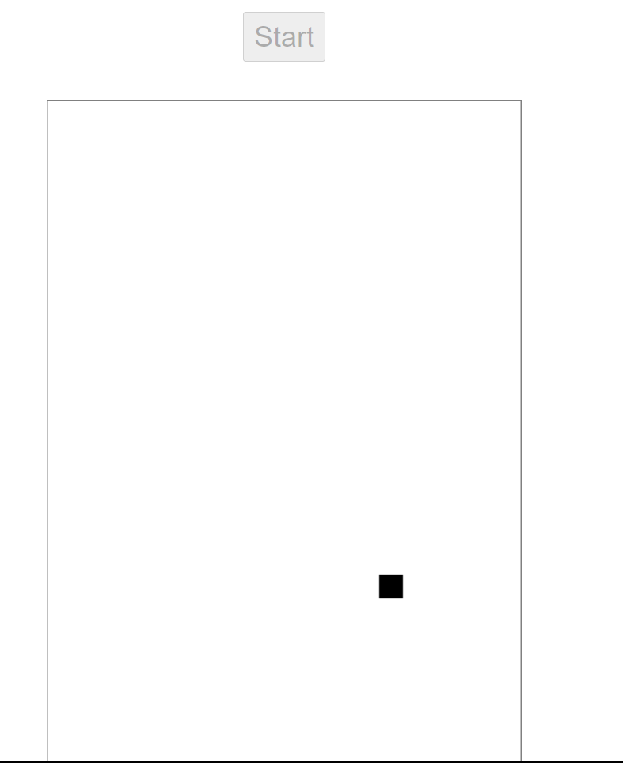
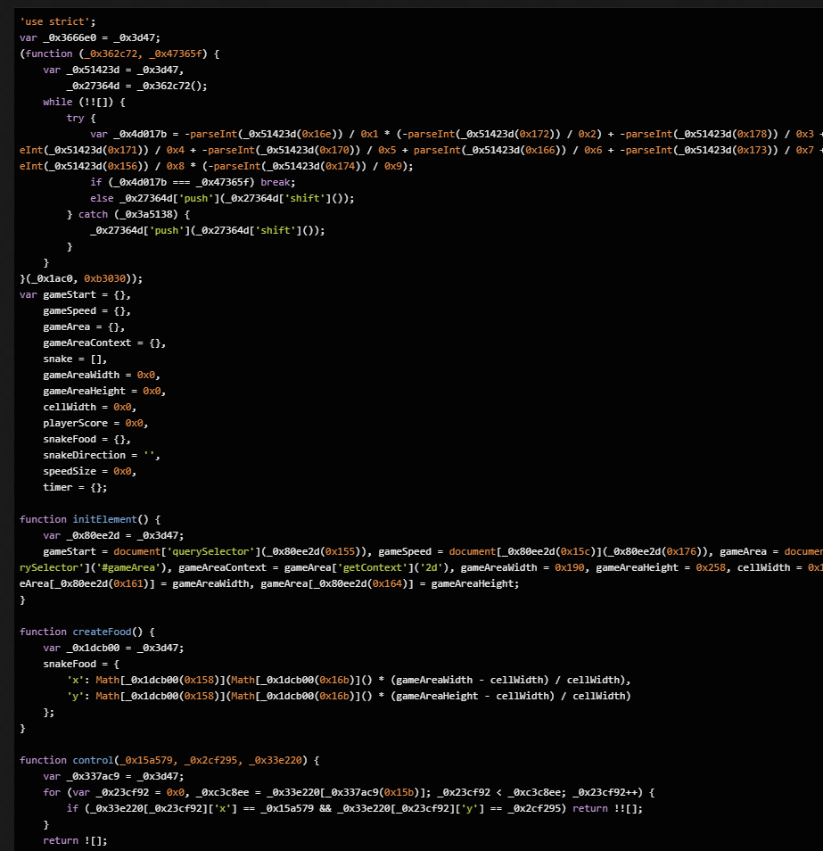
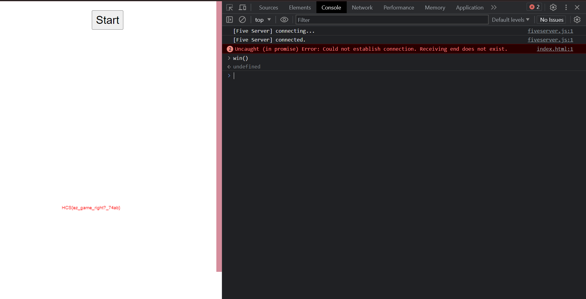

# Snake

**Difficulty:** Easy  
**Flag:** `HCS{ez_game_right?_74ab}`

---

## **EN**

This one was probably the easiest out of all of them. Provided was source code to a snake implementation in JS controlled by the keyboard arrows.  

Checking out the JS, it was obfuscated. Dumped into `https://lelinhtinh.github.io/de4js/`, we get this:  

_Thankfully,_ the function names weren't obfuscated. Scrolling down, we see the `win` function in the analyzed result.

So I just called it via console and that's it. 🎉

---

## **ID**

Ini yang paling gampang menurutku. Diberikan source code game snake berbasis JS yang dikontrol pakai panah di keyboard.  

Dibuka JS-nya, isinya diobfuskasi. Dimasukin ke `https://lelinhtinh.github.io/de4js/`, kita dapet ini:  

_Untungnya,_ nama function-functionnya nggak diobfuskasi juga. Dibawah, kita bisa lihat `win` functionnya di hasil analisisnya.

Jadi tinggal dipanggil di console aja deh. 🎉

