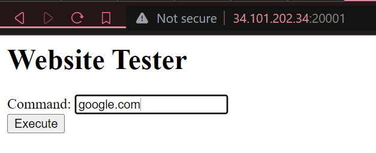

# **ErCeE**

**Difficulty:** Easy  
**Flag:** `HCS{rC3_1TU_54nG4T_m3NY3r4mK4N!!!}`

---

## **EN**

For this challenge, we're provided with a simple PHP website and its [source code](./dist/) that, when provided with a URL, pings the URL using the `ping` CLI utility and renders the result of the command onto the HTML.


Interestingly, the thing doesn't even work lol. Idk if I'm doing something wrong, but inputting `google.com` or anything into the input field and submitting the form, we get nothing rendered, when there really should've been something in there afaik.  


Anyway, that's besides the point, looking at the source code, we see that this is accomplished via running the `ping` utility via CLI directly.

So, to me, it's pretty clear now, whenever there's an eval-like snippet, there's an RCE. There _is_ a bit of sanitization done on the string being run,

```php
function sanitizeString($input) {
	$sanitized = str_replace(array('|', '>', '<', '&'), '', $input);
	return $sanitized;
}
```

but it wouldn't be enough, as a `; ls #` input confirms this.


So, all we need to do, is understand where the flag is, and just `cat` it. Doing `; ls / #` gives us the answer to that question,


and now just, a `; cat /flag.txt #`, and we're done!  


---

## **ID**

Untuk yang ini, kita diberi [source code](./dist/) ke website PHP yang kalau dikirimi URL, akan nge-ping si URL pakai utility `ping` dan ngerender hasilnya ke HTML.


Uniknya itu, ini kayaknya nggak bisa sebenernya. Aku nggak tau apa aku yang salah apa bagaimana, tapi menginput `google.com` atau apapun ke input terus submit nggak menghasilkan apa-apa.  


_Anyway_, kalau kita liat di source codenya, kita bisa lihat kalau ini menggunakan `ping` langsung dari CLI.

Nah, udah jelas deh, ketika ada eval-like, pasti ada RCE. Ada sih, sanitasi ke string yang di-input,

```php
function sanitizeString($input) {
	$sanitized = str_replace(array('|', '>', '<', '&'), '', $input);
	return $sanitized;
}
```

tapi nggak cukup, karena `; ls #` mengkonfirmasi ini.


Sekarang tinggal cari tau dimana flagnya, terus di `cat`. Nge-`; ls / #` menjawab pertanyaan pertama,


nah, tinggal `; cat /flag.txt #`, selesai!  

