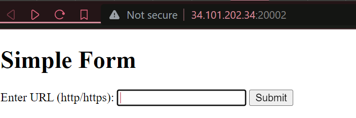
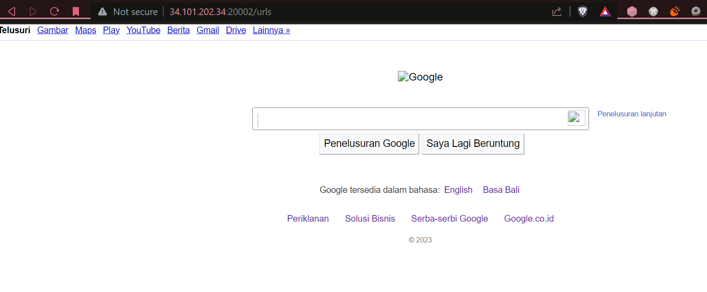
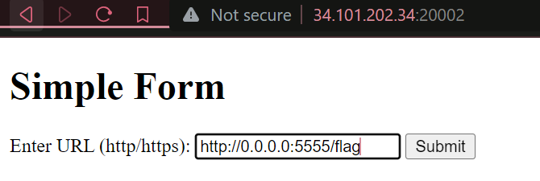
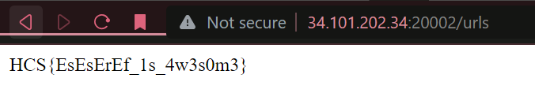

# **Requests**

**Difficulty:** Easy  
**Flag:** `HCS{EsEsErEf_1s_4w3s0m3}`

---

## **EN**

For this challenge, we're provided with a simple website and its [source code](./dist/). The website accepts a form with a single text input and button to submit.  


When a valid URL is inputted into the form and then submitted, the server retrieves the content of the URL and sends it to the client. Here's `https://google.com`:


Inspecting the source code, we can see that the flag is obtainable via the `/flag` route, but this route is only accessible from a local connection (the loopback interface).

```py
@app.route("/flag")
def flag():
    if request.remote_addr == "127.0.0.1":
        return "HCS{fake_flag}"
    else:
        return "Access denied. This endpoint can only be accessed from localhost."
```

This means, we probably need to spoof it in a way that makes it seem like the server itself retrieved the `/flag` route.

However, if we scroll up, requests to the form handler that contain the strings `localhost` or `127.0.0.1` are blocked.

```py
def is_valid_url(url):
    if url.startswith(("http://", "https://")):
        parsed_url = urlparse(url)
        if parsed_url.hostname not in ("localhost", "127.0.0.1"):
            return True
    return False
```

So instead, what we can do, is use a different IP that leads to the loopback interface as well. What I used was `0.0.0.0`, as all this interface does is map to [all IPs that this machine has](https://superuser.com/a/949429) on the network, so connecting to it from the machine will connect back to it on its local network.  
~~And that the code used 0.0.0.0, but we won't talk about that.--~~

Also also, looking at the code again, the server is running on port `5555`,

```py
if __name__ == "__main__":
    app.run(host="0.0.0.0", port=5555)
```

so, `http://0.0.0.0:5555/flag`.

Now all we need to do is call it! 👏  
  


---

## **ID**

Disini kita diberi suatu website simpel dan [source code](./dist/)nya. Dia menerima form input teks dan sebuah tombol submit.  


Ketika diisi sebuah URL valid terus disubmit, servernya nge-_fetch_ konten di URL itu dan dikirim balik ke klien. Ini `https://google.com`:


Kalo kita liat *source code*nya, kita bisa dapet flag dari _route_ `/flag`, tapi routenya cuman bisa diakses dari lokal (loopback interface).

```py
@app.route("/flag")
def flag():
    if request.remote_addr == "127.0.0.1":
        return "HCS{fake_flag}"
    else:
        return "Access denied. This endpoint can only be accessed from localhost."
```

Ini berarti, kita harus buat ini biar server berpikir kalau dia sendiri yang mengakses _route_ `/flag`.

Tapi, kalau kita liat ke atas, kita bisa lihat kalau request ke _form handler_ yang mengandung `localhost` atau `127.0.0.1` diblokir.

```py
def is_valid_url(url):
    if url.startswith(("http://", "https://")):
        parsed_url = urlparse(url)
        if parsed_url.hostname not in ("localhost", "127.0.0.1"):
            return True
    return False
```

Jadi, kita harus pakai sebuah IP yang ujungnya balik lagi ke loopback interface. Yang aku pake `0.0.0.0`, karena ini interfacenya nge-map [ke semua IP si server](https://superuser.com/a/949429) di network, konek ke situ dari si server bakal sama kayak loopback.  
~~Di kodenya pake 0.0.0.0 juga sehh---~~

Terus, di kodenya juga disebutkan kalau dia dihosting di port `5555`,

```py
if __name__ == "__main__":
    app.run(host="0.0.0.0", port=5555)
```

jadi, `http://0.0.0.0:5555/flag`.

Udah deh! 👏  
  

